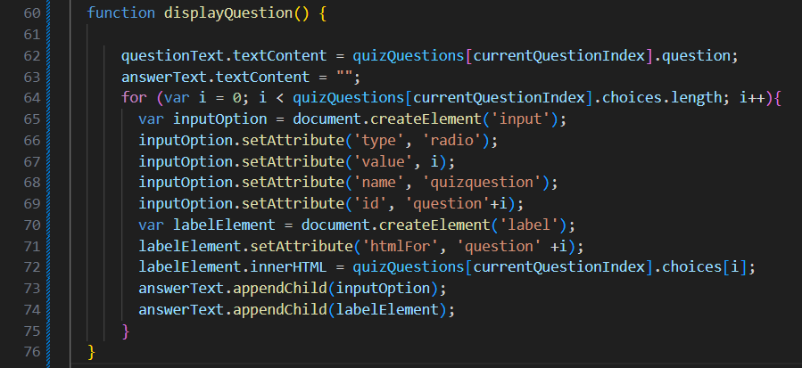

# WebAPI_codeQuiz
This webpage was made to dynamically change by user input so that the User can take a quiz and log their information in the website's local storage.

The HTML is very bare bones since most elements are either added or changed by the Javascript. The most important thing to note in the HTML is the empty elements, they're empty so that they won't show anything on the page but can be changed and hold elements later.

The CSS Stylesheet is very barebones as well, even more so than the HTML. This is mostly because the focus of this project was more about making the website work conviently for the User, rather than make the webpage look as nice as possible.

The javascript starts with a variety of global variables that reference different elements of the HTML.

The next section of the JS (Javascript) is the question constant, which is the questions, options, and answer value so that when referred to later, instead of worrying about a string value, the value is a lot more straight forward.

The JS then moves into assigning functions to variables, the first is to make it so that when you click the "startQuiz" button on the webpage so that it will remove itself and then run the "startGame" function, which runs two functions (the "startTimer" function, then the "displayQuestion" function. We will look at these later).

There are a few more variables added, but rather than needing them to recall elements of the HTML, they set different numerical values to them since they're not for aesthetics or visuals but rather more important to the function of the quiz (though the last two variables do end up having their values displayed later).

The function then makes two variables, one to make a new button to replace the start game button and one to call the element in the HTML that will hold it. The next few lines (41-43) are to place the newly created button into the div element called by the buttonDiv variable, and to assign value to the button so it'll function as needed. The last two lines are to set a new event listener so it can run the "checkAnswer" function when the button is clicked. 

This part of the JS is the startTimer function which sets the timer to count by intervals, sets the timer to count down, uses variables to display the timer on the page, and to run the "gameOver" function when the value is 0 or less. The 1000 makes it so the timer counts down in seconds rather than minutes or miliseconds (which could be done by adding or removing 0s).

The displayQuestion function is a bit heftier than most other functions in this JS but that's because this section changes the most elements on the page and in the HTML. This function starts with assigning the variable "questionText" with the text from the question portion of the "quizQuestions" contant and the variable "answerText" gets assigned an empty string to start. 
There's then a For Loop that will be used so that the questions and answers understand to loop through the different questions until it reaches the last question in which case the game will end. 
The rest of the function after the For Loop is to add radio input elements to the answerText portion of the HTML and assign them the value of "answer" from the "quizQuestion" constant and the text content of "choices" gets displayed by the radio input element

The last section of the code is two functions, the first of which is the "checkAnswer" function which checks the value of which radio input is checked. It starts with setting a value to a local constant, and then uses "If...Else..." lines of code to make it so when the User's checked radio element's value matches the correct answer that it will add a point to the "score" value and move onto the next question. If the checked radio element has a different value when this function is ran, it will not progress to the next question and subtract 5 seconds from the "timeLeft" variable. This function ends with "If... Else..." so that when the user runs out of questions, the page knows the game is over and it needs to run the "gameOver" function.
The gameOver function clears the timer, sets timeLeft to 0, prompts the user to tell them their score and ask them to input their name, then logs the score and input into local storage.

